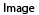

# Markdown syntax

## Block elements
###### Headings 1-6 and alternate headings
---
===
+ Unordered List
- Unordered List
* Unordered List
1. Ordered List
> Blockquote

## Inline elements
- *italic* / _italic_ , **bold** / __bold__
- [Link text](http://domain.com) or <http://domain.com> or http://domain.com
- 
- 
- `code`
- HTML comment: <!-- HTML comment -->

## Bugs
- `<html>` tags aren't highlighted
- *Spaces between italic words (_only with_ the single asterisk syntax)*
- _Styles that **should overlap** do not_
- (http://example.net "with optional title not hightlighted")
